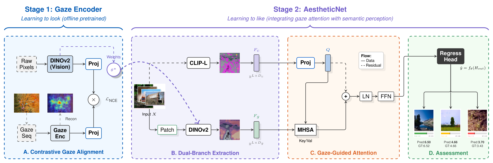

# Learning to Look before Learning to Like: Incorporating Human Visual Cognition into Aesthetic Quality Assessment

[](https://cognitivesciencesociety.org/cogsci-2026/)
[](https://www.python.org/)
[](https://pytorch.org/)
[](https://opensource.org/licenses/MIT)


## Introduction

Current Aesthetic Quality Assessment (AQA) models heavily rely on large-scale Vision-Language Models (e.g., CLIP), which inherently suffer from a rigid object-centric bias and overlook the global compositional harmony of an image. 

**AestheticNet** addresses this by computationally modeling the human dual-process cognitive mechanism. We introduce a Gaze-Aligned Visual Encoder (GAVE)—based on DINOv2 and contrastively aligned with human oculomotor traces—to capture the implicit "visual grammar" (System 1). This perceptual prior is then fused with frozen semantic representations (System 2) via a directed cross-attention mechanism, establishing a cognitive-computational bridge between active vision and aesthetic judgment.

## Architecture

<p align="center">
  
</p>

> **The Cognitive Architecture of AestheticNet.** **(A) Contrastive Gaze Alignment:** The Gaze Encoder aligns raw pixels with eye-tracking sequences to learn a general "gaze grammar". **(B) Dual-Branch Extraction:** A frozen Semantic Encoder (CLIP) and the Gaze-Aligned Visual Encoder (GAVE) extract content and perceptual form respectively. **(C) Gaze-Guided Attention:** Semantic representations actively query gaze-aligned features via directed attention. **(D) Assessment:** The synthesized representation is mapped to a scalar aesthetic score.


---
## Installation


**1. Clone the repository:**
```bash
git clone "https://github.com/yyyu-zymz/AestheticNet.git"
cd AestheticNet
```

**2. Create a virtual environment:**
```bash
conda create -n aestheticnet python=3.10 -y
conda activate aestheticnet
```

**3. Install dependencies:**
First, install PyTorch matching your hardware specifications (the following command is an example for CUDA 11.8).
```bash
pip install torch torchvision --index-url "https://download.pytorch.org/whl/cu118"
```
Then, install the rest of the minimal required packages:
```bash
pip install -r requirements.txt
```

## Data Preparation

Due to copyright constraints and large file sizes, the raw datasets are not included in this repository. Please follow the instructions below to configure the data environment.

**1. AVA Dataset**
* Download the dataset from [Kaggle: AVA Aesthetic Visual Assessment](https://www.kaggle.com/datasets/nicolacarrassi/ava-aesthetic-visual-assessment).
* Extract the contents and place the `images/` folder and `AVA.txt` into `data/ava_raw/`.

**2. Eye-tracking**

* Download the dataset from the [Dryad Digital Repository](https://datadryad.org/stash/dataset/doi:10.5061/dryad.9pf75).
* We specifically utilize the fixation data from **Category 7** and **Category 8** (representing natural and architectural landscapes).
* Place the extracted `Baseline_1d_data.csv` into `data/raw_gaze_data/`.

**3. Data Preprocessing & Alignment**
Once the raw datasets are placed in their respective directories, run our automated subset builder. This script filters the massive AVA dataset down to the 8 targeted compositional categories used in our dual-pathway experiments.

```bash
python data/build_ava_subset.py --source_dir ./data/ava_raw --output_dir ./data/preprocessed
```
This will generate the `filtered_annotations.csv` and securely map the image subsets required for training.


## Training Pipeline

### Stage 1: Contrastive Gaze Alignment
In this stage, the Gaze-Aligned Visual Encoder (GAVE) is pre-trained to align the DINOv2 backbone with human oculomotor dynamics using a contrastive InfoNCE loss.

```bash
# Start Stage 1 training
python stage1_alignment/train_stage1.py
```
* **Output:** The optimal weights for the visual pathway ($f^*$) will be exported to `outputs/stage1_cga/checkpoints/gazenet_dinov2_best.pth`.

### Stage 2: Dual-Pathway Fusion
This stage freezes the Semantic Encoder (CLIP) and fine-tunes the GAVE through a cross-attention fusion layer to predict final aesthetic scores using the Hybrid Loss (MSE + PLCC penalty).

```bash
# Start Stage 2 training (automatically loads weights from Stage 1)
python stage2_aesthetic/train_stage2.py
```
* **Note:** Ensure the Stage 1 checkpoint exists before starting Stage 2.

---

## Citation

If you use this code or our research findings, please use the following BibTeX entry:

```bibtex
@inproceedings{yu2026learning,
  title     = {Learning to Look before Learning to Like: Incorporating Human Visual Cognition into Aesthetic Quality Assessment},
  author    = {Yu, Liwen and Liu, Chi and Han, Xiaotong and Zhu, Congcong and Wang, Minghao and Shen, Sheng},
  booktitle = {Proceedings of the 48th Annual Conference of the Cognitive Science Society},
  year      = {2026},
  note      = {To appear}
}
```

---

## Acknowledgments & License

This research is supported by the **GRIN Lab (Faculty of Data Science, City University of Macau)**. We acknowledge the collaborative contributions from the **Zhongshan Ophthalmic Center (Sun Yat-sen University)** and **Torrens University Australia**. 

Special thanks to the open-source communities of DINOv2 and CLIP. 

This project is licensed under the **MIT License**. See the [LICENSE](LICENSE) file for details.